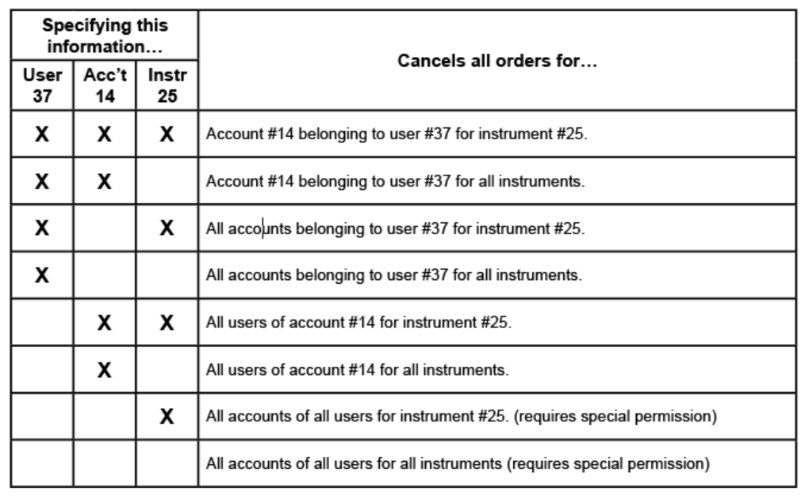

## CancelAllOrders

**Category:** User<br />
**Permissions:** Operator, Trading<br />
**Call Type:** Synchronous

Cancels all open matching orders for the specified instrument, account, user (subject to permission level) or a combination of them on an Order Management System. User and account permissions govern cancellation actions. A user with Trading permission can cancel orders for himself, any instrument traded by the account, or any account with which he's associated; a user with Operator permissions can cancel orders for any account, instrument, or user.


<aside class="notice"><strong>Note:</strong> Multiple users may have access to the same account.</aside>



### Request

```json
{
  "AccountId": 0, // conditionally optional
  "UserId": 0, // conditionally optional
  "OMSId": 0
  "InstrumentId": 0, // conditionally optional
}
```

| Key       | Value                                                        |
| ------------ | ------------------------------------------------------------ |
| AccountId    | **integer.** The account for which all orders are being canceled. *Conditionally optional.* |
| UserId       | **integer.** The ID of the user whose orders are being canceled. *Conditionally optional.* |
| OMSId        | **integer.** The Order Management System under which the account operates. *Required*. |
| InstrumentId | **long integer.** The ID of the instrument for which all orders are being cancelled. *Conditionally optional.* |

### Response

```json
{
  "result": true,
  "errormsg": "”,
  "errorcode": 0,
  "detail": "",
}
```

| Key    | Value                                                        |
| --------- | ------------------------------------------------------------ |
| result    | **Boolean.** If the call has been successfully received by the Order Management System, result is *true*; otherwise, it is *false*. This does not mean that the orders have been canceled &mdash; just that the request to cancel them has been received successfully. |
| errormsg  | **string.** A successful receipt of the call returns *null*; the *errormsg* parameter for an unsuccessful call returns one of the following messages:<br />Not Authorized (errorcode 20)<br />Invalid Request (errorcode 100)<br />Operation Failed (errorcode 101)<br />Server Error (errorcode 102)<br />Resource Not Found (errorcode 104) |
| errorcode | **integer.** A successful receipt of the call returns 0. An unsuccessful receipt of the call returns one of the *errorcodes* shown in the *errormsg* list. |
| detail    | **string.** Message text that the system may send. The content of this parameter is usually null. |

The response to **CancelAllOrders** verifies that the call was received, not that the orders have been canceled successfully. Individual event updates to the user show orders as they cancel. To verify that an order has been canceled, use **GetOrderStatus** or **GetOpenOrders.**


