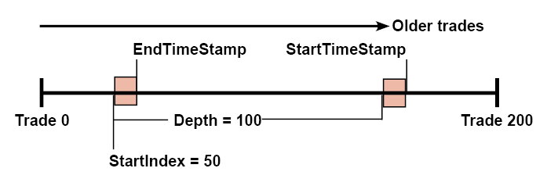

## GetTradesHistory

**Category:** User<br />
**Permissions:** Operator, Trading<br />
**Call Type:** Synchronous

Retrieves a list of trades for a specified account, order ID, user, instrument, or starting and ending time stamp. The returned list begins at start index *i,* where *i* is an integer identifying a specific trade in reverse order; that is, the most recent trade has an index of 0. “Depth” is the count of trades to report backwards from *StartIndex*. 



Users with Trading permission can retrieve trade history for accounts with which they are associated; users with Operator permission can retrieve trade history for any account.

<aside class="warning"><strong>Caution</strong>: You must coordinate *StartIndex*, *Depth*, *StartTimeStamp*, and *EndTimeStamp* to retrieve the historical information you need. As the diagram shows, it is possible to specify values (for example, *EndTimeStamp* and *Depth*) that can exclude information you may want (the red areas).</aside>


<aside class="notice"><strong>Note</strong>: In this call, “Depth” refers not to the depth of the order book, but to the count of trades to report. The owner of the trading venue determines how long to retain order history before archiving.</aside>

### Request

>  All values in the request other than omsId are optional. 

```json
{
    "omsId":0,
    "accountId":0,
    "instrumentId":0,
    "tradeId":0,
    "orderId":0,
    "userId":0,
    "startTimestamp":0,
    "endTimestamp":0,
    "depth":100,
    "startIndex":0,
    "executionId":0
}
```

| Key            | Value                                                        |
| -------------- | ------------------------------------------------------------ |
| omsId          | **Integer.** The ID of the Order Management System on which the trades took place. If no other values are specified, **GetTradesHistory** returns the trades associated with the default account for the logged-in user on this Order Management System. *Required key and value.* |
| accountId      | **Integer.** The account ID that made the trades. If no account ID is supplied, the system assumes the default account for the logged-in user making the call. |
| instrumentId   | **long integer.** The ID of the instrument whose trade history is reported. If no instrument ID is included, the system returns trades for all instruments associated with the account ID and OMS. |
| tradeId        | **integer.** The ID of a specific trade. If you specify *TradeId*, **GetTradesHistory** can return all states for a single trade. |
| orderId        | **integer.** The ID of the order resulting in the trade. If specified, the call returns all trades associated with the order. |
| userId         | **integer.** The ID of the logged-in user. If not specified, the call returns trades associated with the users belonging to the default account for the logged-in user of this OMS. |
| startTimeStamp | **long integer.**  The historical date and time at which to begin the trade report, in POSIX format. If not specified, reverts to the start date of this account on the trading venue. |
| endTimeStamp   | **long integer.** Date at which to end the trade report, in POSIX format. |
| depth          | **integer.** In this case, the count of trades to return, counting from the *StartIndex*. If *Depth* is not specified, returns all trades between *BeginTimeStamp* and *EndTimeStamp*, beginning at *StartIndex*. |
| startIndex     | **integer.** The starting index into the history of trades, from 0 (the most recent trade) and moving backwards in time. If not specified, defaults to 0. |
| executionId    | **integer.** The ID of the individual buy or sell execution. If not specified, returns all. |

### Response

> The response returns an array, one element for each trade.

```json
[
    {
        "omsId":0,
        "executionId":0,
        "tradeId":0,
        "orderId":0,
        "accountId":0,
        "subAccountId":0,
        "clientOrderId":0,
        "instrumentId":0,
        "side":0,
        "quantity":0.0,
        "remainingQuantity":0.0,
        "price":0.0,
        "value":0.0,
        "tradeTime":0
    }
]
```

| Key               | Value                                                        |
| ----------------- | ------------------------------------------------------------ |
| omsId             | **integer.** The ID of the Order Management System on which the trade took place. |
| executionId       | **integer.** The ID of the sell- or buy-side portion of the execution initiated by the *AccountId* specified in request. |
| tradeId           | **integer.** The ID of the overall trade.                    |
| orderId           | **integer.** The ID of the order that resulted in the trade. |
| accountId         | **integer.** The ID of the account under which the trade was executed. |
| subAccountId      | **integer.** Not currently used; reserved for future use. Defaults to 0. |
| clientOrderId     | **long integer.** A user-assigned ID for the order (like a purchase-order number assigned by a company). If not supplied, *ClientOrderId* defaults to 0. |
| instrumentId      | **integer.** The ID of the instrument being traded.          |
| side              | **integer.** A number representing this trade's the side of the transaction. One of:<br />0 Buy<br />1 Sell<br />2 Short<br />3 Unknown (error condition). |
| quantity          | **real.** The quantity of the instrument being traded.       |
| remainingQuantity | **real.** Any quantity remaining in the order after this trade. |
| price             | **real.** The unit price of the order.                       |
| value             | **real.** The overall value of the trade, calculated as price X quantity. |
| tradeTime         | **long integer.** The time at which the trade took place, in POSIX format. |

